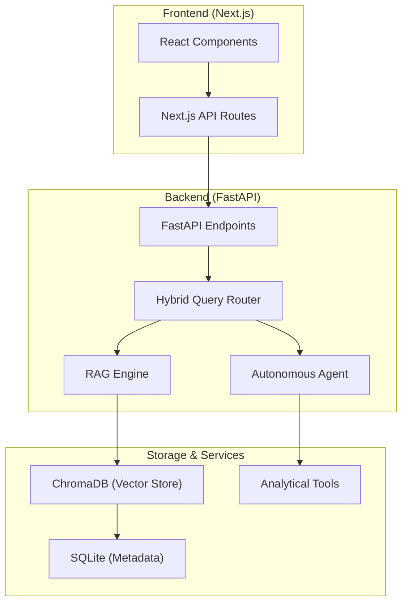

# AI Real Estate Assistant

Integrated AI platform designed for real estate agencies to facilitate property discovery and analysis through natural language processing. This system leverages a modular architecture combining Retrieval-Augmented Generation (RAG) with autonomous agents to provide semantic search, financial modeling, and real-time market insights.

## Executive Overview

The AI Real Estate Assistant addresses the friction in modern property search by replacing static filters with a conversational, context-aware interface. Unlike traditional RAG implementations, this system employs a hybrid routing mechanism that intelligently differentiates between simple information retrieval and complex multi-step analytical tasks. It provides a production-ready foundation for agencies looking to deploy private, scalable AI agents that integrate directly with property datasets.

## Key Features

### Multi-Provider LLM Orchestration
The platform supports a diverse array of model providers through a unified interface, including:
- **Commercial**: OpenAI (GPT-4o), Anthropic (Claude 3.5), Google (Gemini 2.0 Flash), and DeepSeek.
- **Local**: Full integration with Ollama for hosting Llama 3, Mistral, and Qwen models on-premises.

### Intelligent Query Processing
- **Intent Classification**: Automated classification of user queries into RAG-based search or agentic tool execution.
- **Smart Routing**: Simple inquiries utilize high-performance RAG paths, while complex requests (e.g., investment analysis) invoke a specialized agent with access to a mortgage calculator and property comparison tools.

### Advanced Retrieval Infrastructure
- **Vector Storage**: Persistent storage via ChromaDB for semantic indexing.
- **Hybrid Search**: Combines vector-based semantic retrieval with keyword-based search using MMR (Maximal Marginal Relevance) for result diversity.
- **Reranking**: Integrated reranking logic to improve retrieval precision for complex spatial and financial queries.

### Interactive User Experience
- **Real-time Streaming**: Server-Sent Events (SSE) for low-latency, streaming responses.
- **Dynamic Visualization**: Context-aware property cards and interactive spatial data rendering using Next.js.

## Architecture

The system is designed as a decoupled monorepo, ensuring clear separation of concerns between the presentation layer and the orchestration engine.



## Tech Stack

- **Backend**: Python 3.12+, FastAPI, LangChain, Pydantic, SQLAlchemy.
- **Frontend**: TypeScript, Next.js 15, Tailwind CSS, Lucide React.
- **Storage**: ChromaDB (Vector), SQLite (Relational).
- **Environment**: Uv (Package Management), Docker, Ruff (Linting).

## Installation

### Prerequisites
- Python 3.12 or higher.
- Node.js 20 or higher.
- Docker and Docker Compose (recommended for containerized deployment).

### Setup
1. Clone the repository:
   ```bash
   git clone https://github.com/Daniel-Lopez/ai-real-estate-assistant.git
   cd ai-real-estate-assistant
   ```

2. Initialize environment variables:
   ```bash
   cp .env.example .env
   # Edit .env to include your preferred LLM provider API keys.
   ```

3. Backend Setup (Local):
   ```bash
   pip install uv
   uv venv
   .venv\Scripts\activate # Windows
   # source .venv/bin/activate # Unix
   uv pip install -e .[dev]
   ```

4. Frontend Setup (Local):
   ```bash
   cd apps/web
   npm install
   ```

## Configuration

Standard configuration is managed through a centralized `AppSettings` model using `pydantic-settings`. Key parameters include:

- `OPENAI_API_KEY`: Required for OpenAI model access.
- `DATABASE_URL`: Defaults to local SQLite; can be configured for PostgreSQL in production.
- `CHROME_DB_PATH`: Directory for vector storage persistence.
- `ENVIRONMENT`: Set to `production` or `development` to toggle CORS and security policy depth.

## Usage Examples

### Starting Development Servers
Execute the following command from the root directory to start both backend and frontend services:
```bash
npm run dev
```

### Running with Docker
For a production-adjacent environment:
```bash
docker compose -f deploy/compose/docker-compose.yml up --build
```

## Folder Structure

```text
├── apps/
│   ├── api/          # FastAPI backend service
│   └── web/          # Next.js frontend application
├── docs/             # Technical documentation and specifications
├── scripts/          # Automation and deployment utilities
├── deploy/           # Docker and CI/CD configuration
├── tests/            # Integration and end-to-end test suites
└── package.json      # Monorepo configuration
```

## Deployment

### Frontend (Vercel)
The frontend is optimized for Vercel. Ensure `BACKEND_API_URL` is set in the Vercel dashboard to point to your deployed API.

### Backend (Containerized)
The backend can be deployed via Docker to any cloud provider supporting container orchestration (e.g., Render, Railway, AWS ECS). Standard health checks are available at `/health`.

## Performance and Scalability

- **State Management**: Chat history is persisted in SQLite, allowing for stateless API scaling.
- **Vector Efficiency**: ChromaDB indices are optimized for concurrent reads.
- **Caching**: Optional Redis integration for response caching and rate limiting in high-traffic environments.

## Security Considerations

- **API Security**: All endpoints are protected via API Key authentication or JWT if enabled.
- **Data Protection**: CORS policies are strictly enforced. Pre-commit hooks include secret scanning via Gitleaks.
- **Isolation**: Dockerized deployment ensures service isolation and controlled resource allocation.

## Roadmap

- **Q2 2026**: Multi-lingual support for property descriptions.
- **Q3 2026**: Integration with third-party CRM systems (Salesforce, HubSpot).
- **Q4 2026**: Advanced image analysis for automatic amenity extraction from property photos.

## Contributing

Guidelines for contribution are detailed in `docs/development/CONTRIBUTING.md`. Please follow the branch strategy (feature branches against `main`) and ensure all tests pass before submitting a pull request.

## License

Distributed under the MIT License. See `LICENSE` for more information.

Copyright (c) 2026 Daniel Lopez
